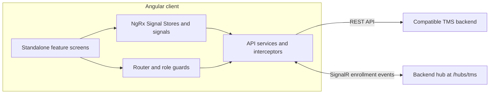

# TMS Client

An Angular web client for a Training Management System. It brings course discovery, enrollment, instructor workflows, and student services into one role-aware interface.

<p align="center">
	
	
</p>

## Screenshots

<!-- Replace each placeholder with the corresponding screenshot when available. -->

<table>
	<tr>
		<td align="center"><!-- Replace with actual screenshot: Student dashboard -->Student dashboard</td>
		<td align="center"><!-- Replace with actual screenshot: Instructor dashboard -->Instructor dashboard</td>
		<td align="center"><!-- Replace with actual screenshot: Course management -->Course management</td>
	</tr>
</table>

## Key Features

- **Student experience:** browse courses, submit enrollment requests, and review personal enrollments.
- **Instructor workflows:** view course and enrollment dashboards, approve or reject enrollment requests, and submit grades.
- **Course administration:** create, edit, and remove courses, with instructor assignment support.
- **Student services:** request course certificates and generate, track, and download transcripts.
- **Authentication & access control:** sign-in and registration, authentication-aware routing, and role-based route guards.
- **Live enrollment updates:** receive enrollment status changes over SignalR.

## Architecture

The backend API is maintained in a [separate repository](https://github.com/asegithub2023/TmsApiInstead). Visit it for the backend implementation and architecture.



Feature screens are grouped by user workflow. Shared services handle HTTP and SignalR integration, signal stores manage course and enrollment state, and guards/interceptors centralize route access and request behavior.

## Tech Stack

| Area            | Technologies                                   |
| --------------- | ---------------------------------------------- |
| Frontend        | Angular 21, TypeScript 5.9, SCSS               |
| UI              | Angular Material, Angular CDK, Bootstrap Icons |
| State and async | NgRx SignalStore, Angular signals, RxJS        |
| API integration | Angular HttpClient, Microsoft SignalR          |
| Testing         | Vitest, Playwright                             |

## Project Structure

```text
src/
└── app/
		├── features/       # Student, instructor, admin, and authentication screens
		├── services/       # REST API and SignalR integration
		├── store/          # Course and enrollment signal stores
		├── models/         # Course and enrollment types
		├── guards/         # Authentication and role-based route access
		├── interceptors/   # Credentials, errors, and bearer-token handling
		└── ui/             # Shared course card and analytics chart
e2e/                    # Playwright end-to-end tests
public/                 # Static assets
```

## Fork & Clone

1. Fork this repository using your Git hosting provider.
2. Clone your fork (replace the placeholder with its clone URL):

   ```bash
   git clone <your-fork-url>
   cd tms-client
   ```

3. To contribute changes back, push your branch to your fork and open a pull request against the source repository.

## Getting Started

**Prerequisites:** Node.js 20.19+, 22.12+, or 24+ and npm.

```bash
npm install
npm start
```

Open [http://localhost:4200](http://localhost:4200). The development proxy forwards `/api` and `/hubs` to `http://localhost:5196`; run a compatible TMS backend separately for API-backed workflows. The SignalR client connects to `/hubs/tms`.

### Build & test

```bash
npm run build
npm test
```

End-to-end tests are run with `npx playwright test`. Start the client and compatible backend first. The Playwright authentication setup requires `TMS_ADMIN_EMAIL` (or `TMS_ADMIN_USER`) and `TMS_ADMIN_PASS` to be set in the test shell.

## Engineering Highlights

- Standalone, workflow-oriented components with lazy-loaded feature routes.
- Signal-based UI state and NgRx SignalStores; enrollment actions apply optimistic state updates with rollback on API errors.
- Shared HTTP interceptors provide credentials, bearer-token attachment, error handling, and XSRF configuration.
- Enrollment events use a reconnecting SignalR connection; transcript requests support idempotency keys, status polling, and file downloads.
- Unit and browser-level tests are configured with Vitest and Playwright.
